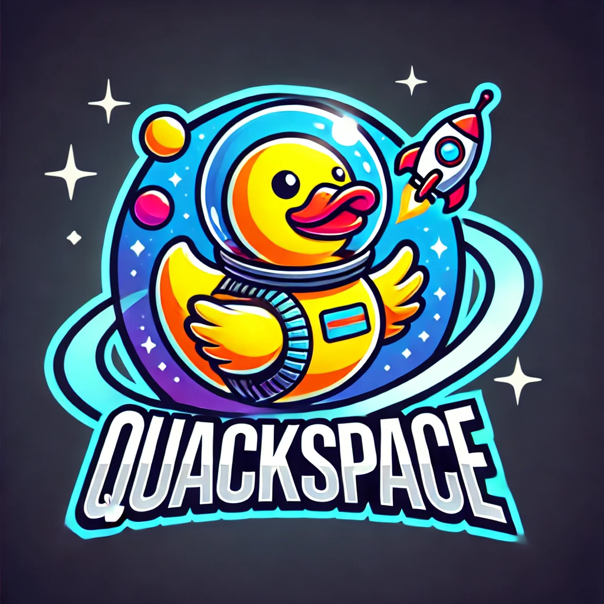

# **Sujet initial : QuackSpace**



## **Contexte**

**QuackSpace** est un projet innovant développé pour répondre à une mission ambitieuse : envoyer des canards en plastique de teint normalisé jaune dans l’espace, symbolisant l’innovation ludique et la maîtrise des technologies spatiales. Ces canards serviront de messagers pour promouvoir les valeurs de notre entreprise à travers les galaxies.

L’objectif est de concevoir une application permettant de gérer tous les aspects techniques et opérationnels du projet, depuis la gestion des canards et des fusées jusqu’au suivi détaillé des missions.

## **Objectifs du projet**

L’application logicielle doit répondre aux objectifs suivants :

### **Lancement spatial des canards**

- Chaque fusée doit pouvoir transporter un nombre prédéfini de canards.
- Chaque lancement doit :
  - Vérifier que les canards sont correctement embarqués et en bon état.
  - Garantir que la fusée dispose de suffisamment de carburant pour atteindre son orbite cible.
  - Enregistrer le succès ou l’échec de la mission.

#### **Gestion des canards**

- Les canards doivent être identifiés de manière unique (par exemple, via un identifiant ou un numéro de série).
- Il doit être possible d’ajouter de nouveaux canards à la flotte.
- Les canards endommagés doivent être marqués comme inutilisables et exclus des missions.

#### **Gestion des fusées**

- Chaque fusée possède des caractéristiques propres :
  - **Capacité maximale :** nombre de canards pouvant être transportés.
  - **Carburant :** quantité de carburant nécessaire pour une mission réussie.
- Il doit être possible d’ajouter, de modifier ou de retirer des fusées de la flotte.
- L’état de chaque fusée (disponible, en mission, en maintenance) doit être traçable.

#### **Planification des missions**

- Les missions doivent permettre de :
  - Sélectionner une fusée disponible.
  - Embarquer un lot de canards tout en respectant la capacité maximale de la fusée.
  - Calculer si la fusée dispose d’assez de carburant pour le lancement.
  - Préparer un rapport automatique après chaque lancement, incluant :
    - La liste des canards embarqués.
    - Le résultat de la mission (succès/échec).
    - Les éventuels problèmes rencontrés (par exemple : surcharge, canards endommagés).

#### **Suivi des missions**

- Un journal des missions doit être maintenu, contenant :
  - Les informations sur les fusées utilisées (modèle, capacité, carburant).
  - La date et l’heure des lancements.
  - Le statut de chaque mission (succès ou échec).
- Des statistiques globales doivent être accessibles :
  - Nombre total de canards envoyés en orbite.
  - Nombre de missions réussies.
  - État global de la flotte (disponibilité des fusées, canards en stock).

## **Exigences techniques**

Pour assurer la qualité, l’efficacité et la maintenabilité du projet, les exigences suivantes doivent être respectées :

### **Modularité**

- Le code doit être organisé en modules indépendants, chacun ayant une responsabilité bien définie (exemple : gestion des canards, gestion des fusées, suivi des missions).
- Les modules doivent être faiblement couplés pour faciliter les évolutions.

### **Robustesse**

- Les erreurs doivent être gérées de manière proactive :
  - Vérification de la disponibilité des ressources (fusées, carburant, canards).
  - Gestion des cas limites (exemple : tentative d’embarquer un canard endommagé ou de lancer une fusée en surcharge).
- Les logs doivent permettre de suivre les actions critiques et de diagnostiquer rapidement les problèmes.

### **Documentation**

- Une documentation JavaDoc doit être fournie pour toutes les classes, méthodes, et interfaces principales.
- Un fichier README doit :
  - Décrire le projet, ses objectifs et son fonctionnement.
  - Inclure les instructions pour exécuter l’application et les tests.

### **Testabilité**

- Toutes les fonctionnalités critiques doivent être couvertes par des tests unitaires.
- Les tests doivent inclure :
  - Des cas de base (exemple : lancement réussi).
  - Des cas limites (exemple : lancement annulé faute de carburant).

### **Qualité de code**
- Le projet doit respecter les conventions de codage standard.
- Les outils comme **SonarLint** doivent être utilisés pour détecter et corriger les problèmes de style, de complexité, et de duplication.

## Structure du projet

Voici la liste des fichiers et des méthodes à réaliser.

### **Fichier : `Duck.java`**

Classe représentant un canard.

#### Méthodes :

1. **`Duck(int id)`**  
   Constructeur. Initialise un canard avec un identifiant unique et un état par défaut (`NEW`).
2. **`void markAsDamaged()`**  
   Modifie l’état du canard pour le passer à `DAMAGED`.
3. **`DuckStatus getStatus()`**  
   Retourne l’état actuel du canard (`NEW` ou `DAMAGED`).
4. **`int getId()`**  
   Retourne l’identifiant unique du canard.


### **Fichier : `Rocket.java`**

Classe représentant une fusée.

#### Méthodes :

1. **`Rocket(int id, int capacity, int fuel)`**  
   Constructeur. Initialise une fusée avec un identifiant, une capacité maximale de canards et une quantité initiale de carburant.
2. **`boolean loadDuck(Duck duck)`**  
   Tente d’ajouter un canard dans la fusée. Retourne `true` si l’opération réussit (canard valide et place disponible), sinon `false`.
3. **`boolean canLaunch()`**  
   Vérifie si la fusée est prête pour un lancement (carburant > 0 et au moins un canard embarqué). Retourne `true` si elle peut être lancée, sinon `false`.
4. **`void launch()`**  
   Simule le lancement de la fusée. Réduit le carburant à zéro et change le statut à `ON_MISSION`.
5. **`void reset()`**  
   Réinitialise la fusée après une mission, en remettant son statut à `AVAILABLE` et en vidant son contenu de canards.
6. **`RocketStatus getStatus()`**  
   Retourne l’état actuel de la fusée (`AVAILABLE`, `IN_MAINTENANCE`, `ON_MISSION`).
7. **`int getId()`**  
   Retourne l’identifiant unique de la fusée.
8. **`int getCapacity()`**  
   Retourne la capacité maximale de canards que peut transporter la fusée.
9. **`int getFuel()`**  
   Retourne la quantité actuelle de carburant.

### **Fichier : `Mission.java`**

Classe représentant une mission.

#### Méthodes :

1. **`Mission(int id, Rocket rocket)`**  
   Constructeur. Initialise une mission avec un identifiant unique et une fusée.
2. **`void execute()`**  
   Exécute la mission. Si la fusée peut être lancée (`canLaunch()` retourne `true`), le statut de la mission est `SUCCESS`. Sinon, le statut est `FAILURE`.
3. **`MissionStatus getStatus()`**  
   Retourne le statut actuel de la mission (`SUCCESS` ou `FAILURE`).
4. **`int getId()`**  
   Retourne l’identifiant unique de la mission.
5. **`Rocket getRocket()`**  
   Retourne la fusée associée à la mission.

### **Fichier : `DuckStatus.java`**

Enum pour représenter l’état des canards.

#### Valeurs :

- `NEW` : Le canard est neuf et prêt à être embarqué.
- `DAMAGED` : Le canard est endommagé et ne peut pas être embarqué.

### **Fichier : `RocketStatus.java`**

Enum pour représenter l’état des fusées.

#### Valeurs :

- `AVAILABLE` : La fusée est prête pour une mission.
- `IN_MAINTENANCE` : La fusée est en maintenance.
- `ON_MISSION` : La fusée est actuellement en mission.

### **Fichier : `MissionStatus.java`**

Enum pour représenter le statut d’une mission.

#### Valeurs :

- `SUCCESS` : La mission a été exécutée avec succès.
- `FAILURE` : La mission a échoué.

### **Fichier : `MissionLog.java`**

Classe représentant un journal de bord pour les missions.

#### Méthodes :

1. **`MissionLog()`**  
   Constructeur. Initialise un journal de mission vide.

2. **`void logMission(int missionId, String rocketName, MissionStatus status, int ducksLaunched)`**  
   Ajoute une entrée au journal avec les informations suivantes :
   - Identifiant de la mission.
   - Nom de la fusée utilisée.
   - Statut de la mission (succès ou échec).
   - Nombre de canards lancés.

3. **`void printLog()`**  
   Affiche toutes les entrées du journal de mission dans la console.

4. **`void clearLog()`**  
   Supprime toutes les entrées du journal, réinitialisant le journal de mission.

5. **`int getNumberOfMissions()`**  
   Retourne le nombre total de missions enregistrées dans le journal.

6. **`int getNumberOfSuccessfulMissions()`**  
   Retourne le nombre total de missions réussies.

7. **`int getTotalDucksLaunched()`**  
   Retourne le nombre total de canards lancés dans toutes les missions.

# Votre mission : Un projet sous pression

Vous avez de la chance : un collègue, **Philibert Roquart** a déjà préparé une **première version** du projet. Cependant, pour des raisons mystérieuses, il est désormais **injoignable**, vous laissant la lourde responsabilité de reprendre son travail et de le mener à terme.

Le projet doit être livré pour **aujourd'hui à 17h**, mais ne vous inquiétez pas, vous avez tout ce qu'il faut pour y parvenir... du moins en théorie ! 😉

### Où en sommes-nous ?

Un dépôt Git a été préparé contenant la version du projet de Philibert. Il est accessible à cette adresse :  
[**Lien vers le dépôt Git**](https://github.com/PhilibertRoquart/ProjetQuackSpace).

Votre rôle est de **sauver le projet en péril**, en assurant que tout soit fonctionnel, bien structuré, et prêt à impressionner l'entreprise.

## Addendum : Maven et le projet
Bien que l'utilisation de Maven ne fasse pas partie des compétences attendues dans ce TP, un fichier `pom.xml` a été fourni dans votre dépôt de rendu. Ce fichier permet de gérer le lancement des tests de manière automatisée. Vous n'avez pas besoin de comprendre ou de modifier ce fichier pour mener à bien le TP.

### Exécution et tests
Pour exécuter et tester le projet correctement :

1. **Structure des dossiers** :
   - Placez les fichiers sources Java dans le dossier `src/main/java`.
   - Placez les fichiers de test Java dans le dossier `src/test/java`.

2. **Lancer les tests** :
   - Ouvrez un terminal dans le dossier racine du projet (là où se trouve le fichier `pom.xml`).
   - Exécutez la commande suivante :
     ```
     mvn test
     ```
   - Cette commande compilera le projet et exécutera tous les tests situés dans le dossier `src/test/java`.

3. **Résultats des tests** :
   - Les résultats des tests seront affichés dans le terminal.
   - Si tous les tests passent, cela indique que le comportement attendu du projet est respecté.

Vous n'avez pas besoin d'installer des outils supplémentaires ou de configurer Maven vous-même. Le fichier `pom.xml` a été préconfiguré pour que tout fonctionne automatiquement avec la commande ci-dessus.

Bonne chance dans cette mission de sauvetage du projet QuackSpace !

# Travail attendu

**Consigne générale :**  
Le projet se réalise sur GitHub Codespaces. Avant de commencer, assurez-vous que votre environnement est correctement configuré. Il se peut que vous deviez installer les extensions suivantes pour travailler efficacement :  
- **Java Extension Pack** : pour faciliter le développement en Java.  
- **SonarLint** : pour détecter les problèmes de qualité du code et appliquer les bonnes pratiques.  

**Critères d'évaluation :**  
1. **La gestion du dépôt Git :** qualité des commits (messages clairs et informatifs), structure du dépôt, et utilisation appropriée de Git pour organiser le travail.  
2. **Le respect des bonnes pratiques vues en cours :** application des concepts enseignés, choix de conception cohérents et utilisation appropriée des outils et techniques.  
3. **Les réponses aux questions de cours :** capacité à analyser et critiquer les aspects techniques et organisationnels du projet, notamment en lien avec les contributions de Philibert Roquart.  
4. **La propreté et la lisibilité du code fourni :** indentation, nommage des variables et fonctions, clarté des algorithmes, et documentation éventuelle.  

**Remarque :**  

La correction du code sera évaluée dans une moindre mesure. L’objectif est de détecter et corriger les erreurs sans introduire de nouveaux problèmes. Veillez à produire du code fonctionnel et cohérent, en évitant les erreurs autant que faire se peut !  

## Questions de cours (à répondre dans README.md de votre projet)

## Question 1 : Commandes Git de base (4 points)  
**a.** Expliquez la différence entre les commandes `git init` et `git clone`. (2 points)  
**b.** Que se passe-t-il lorsque vous exécutez `git status` dans un dépôt Git ? (2 points)  

## Question 2 : Travail collaboratif avec GitHub (4 points)  
Lors d’un projet collaboratif, un conflit survient après une tentative de fusion d’une branche.  
**a.** Expliquez ce qu’est un conflit Git et pourquoi il se produit. (2 points)  
**b.** Quelles étapes devez-vous suivre pour résoudre ce conflit et finaliser la fusion ? (2 points)  

## Question 3 : Refactoring et conventions de codage (4 points)  
**a.** Définissez ce qu’est une "mauvaise odeur" de code et donnez deux exemples. (2 points)  
**b.** Expliquez pourquoi appliquer les principes DRY et KISS est important dans le développement logiciel. (2 points)  

## Question 4 : Débogage et logs (4 points)  
**a.** Décrivez les principales différences entre une erreur de syntaxe et une erreur de contexte. (2 points)  
**b.** Pourquoi est-il conseillé d’utiliser des logs (niveaux info, warning, error) dans un programme ? Donnez un exemple d’utilisation. (2 points)  

## Question 5 : Tests unitaires avec JUnit (4 points)  
Un développeur écrit un test unitaire pour une méthode appelée `additionner(int a, int b)` qui retourne la somme de deux entiers.  
**a.** Écrivez un test JUnit basique pour vérifier que `additionner(3, 5)` retourne bien 8. (2 points)  
**b.** Expliquez pourquoi les tests unitaires sont importants pour la maintenabilité d’un projet logiciel. (2 points)  


## **Livrables attendus**

L’entreprise attend une solution complète et prête à être utilisée, comprenant :

1. **Application fonctionnelle :**
   - Gestion des canards et des fusées.
   - Planification et exécution des missions.
   - Suivi des statistiques et des missions.

2. **Dépôt Git propre :**
   - Historique clair avec des messages de commits significatifs.
   - Organisation des branches (par exemple : une branche principale et des branches de développement).

3. **Documentation complète :**
   - JavaDoc détaillé pour toutes les parties critiques du code.
   - README expliquant le projet et les instructions d’exécution.

4. **Suite de tests unitaires :**
   - Tests couvrant les fonctionnalités principales.
   - Cas limites bien gérés.

### **Exemple de flux attendu**
1. **Ajout des ressources :**
   - Création d’une fusée (par exemple, modèle "DuckOne" avec une capacité de 10 canards et 500 unités de carburant).
   - Ajout de 10 canards identifiés de manière unique.

2. **Planification de la mission :**
   - Sélection d’une fusée disponible.
   - Embarquement des canards.
   - Vérification des ressources nécessaires (carburant, état des canards).

3. **Lancement :**
   - Lancement de la mission.
   - Résultat enregistré dans le journal des missions.

4. **Statistiques :**
   - Affichage du nombre total de canards envoyés en orbite.
   - Suivi de l’état des fusées et des canards restants.
